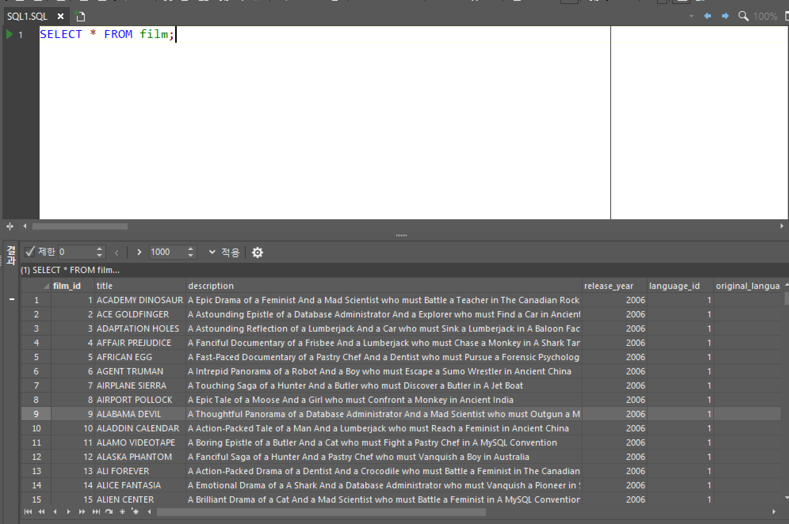
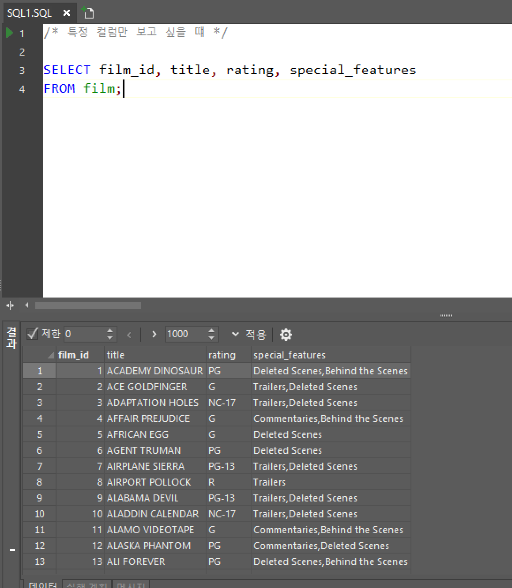
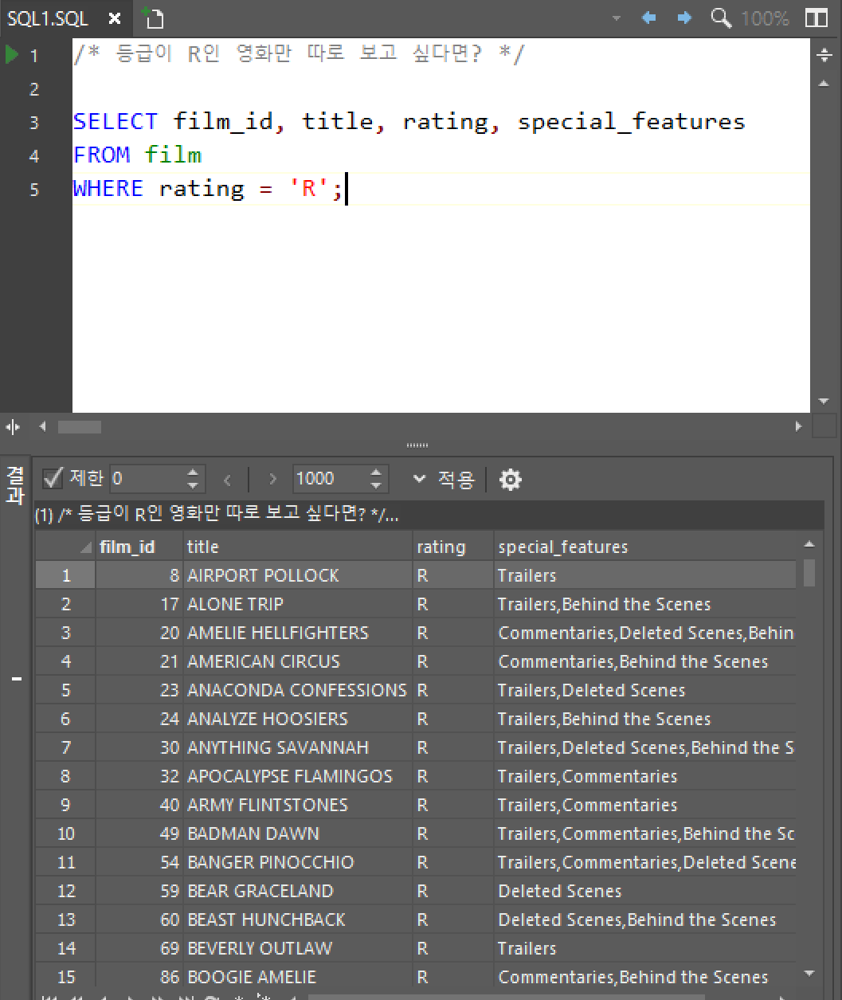
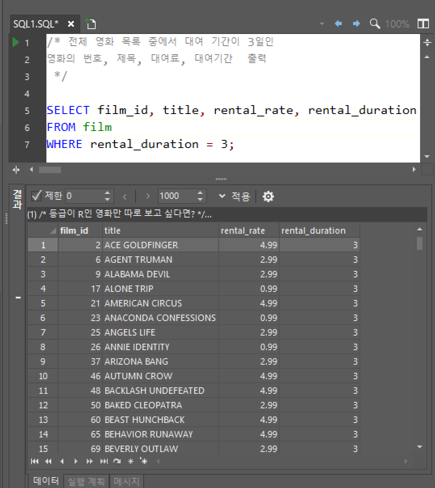

# SQL (SELECT, FROM, WHERE)


SELECT : 선택한 '컬럼'을 보여줘

```
모든 컬럼을 선택할 때 : *
문자을 끝 마칠 때 : ;
그외에 뽑을 열의 이름을 순서대로 적으면됩니다.
```

FROM  :  특정 '테이블'에서

```
뒤에 테이블의 이름을 적어주면됩니다.
```

WHERE :  '조건'에 해당하는

```
찾으려는 조건이 숫자일 때 : WHERE film_id = 5
찾으려는 조건이 문자일 때 : WHERE rating = 'PG'
```


#### SELECT 문과 FROM 사용

영화(film) 테이블에는 어떤 데이터(컬럼)들이 있는지 확인하기

```mysql
/* 영화 테이블에 있는 컬럼을 모두 보고 싶은경우*/
SELECT * FROM film;
```




#### 특정 컬럼만 보고 싶을때

```mysql
/* 특정 컬럼만 보고 싶을 떄 */

SELECT film_id, title, rating, special_features
FROM film;
```




#### 등급이 R인 영화만 따로 보고 싶은경우

``` mysql
/* 등급이 R인 영화만 따로 보고 싶다면? */

SELECT film_id, title, rating, special_features
FROM film
WHERE rating = 'R';
```




#### 전체 영화 목록 중에서 대여 기간이 3일인 영화의 번호, 제목, 대여료, 대여기간  출력


```mysql
/* 전체 영화 목록 중에서 대여 기간이 3일인 
영화의 번호, 제목, 대여료, 대여기간  출력
 */

SELECT film_id, title, rental_rate, rental_duration
FROM film
WHERE rental_duration = 3;
```

